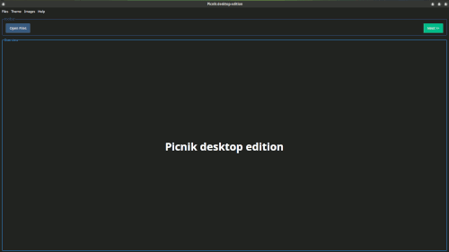
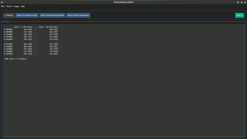
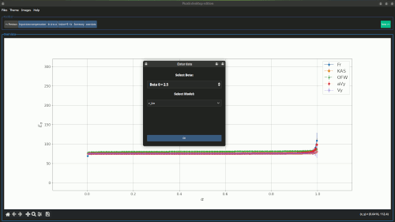
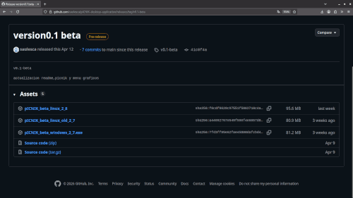

# pICNIK Edition Desktop
Fast, simple, and effective isoconversional kinetic analysis tool.

## What is pICNIK Edition Desktop
**pICNIK Edition Desktop** is a specialized graphical desktop application designed to perform non-isothermal thermogravimetric (TGA) isoconversional kinetic calculations quickly, easily, and effectively. It provides an intuitive workflow guiding users through raw experimental data loading, range selection, conversion analysis, activation energy determination, compensation effect fitting, and model reconstruction.

## Before You Start

**File Format.** Plain text files (**.txt**) or comma-separated value files (.csv).
**Navigation & Validation.** Users can navigate freely between screens using Next » and
« Previous. If an action is skipped, a deferred validation system halts processing when
calculations are requested and prompts the user to complete the missing step.
**Interface Customization.** Theme color and visual styles of title bar adapt automatically
according to the host operating system. The style of the remaining application components
is modified using the options available under the theme in the menu bar.

## Interface Overview & Navigation

The main workspace is divided into three functional areas:
**Menu Bar:**
**Files:** Contains Open files to load experimental data and Exit to close the application.
**Images:** Contains Save image to export the current visualization rendered in the bottom
frame.
**Help:** Contains About (link to pICNIK) and user documentation/tutorials.
**Top Frame:** Dedicated exclusively to primary navigation and action buttons (e.g., Next », «
Previous and Open Files).
**Bottom Frame:** Displays the welcome message upon launch and serves as the primary view
for rendering plots, charts, and tabular reports.

## Step-by-Step Workflow
### Data Loading and Initial Inspection

Load experimental thermogravimetric data files and perform initial inspection.

WHAT YOU NEED Experimental data files (.csv or .txt) for multiple heating rates β

WHAT YOU GET Summary view displaying the six fundamental thermogram plots

Action
In the File sub-menu of the menu bar, select Open file, or select Open file in the top frame choose dataset files using the system file chooser.

## Individual Curve Visualizations

Examine specific physical curves individually across time and temperature domains.

WHAT YOU NEED Data loaded in Step 1
WHAT YOU GET Specialized views: TG vs. time, DTG vs. time dT /dt vs. time, TG vs. Temperature, DTG vs. temperature, and dT /dt vs. temperature

Action
Click corresponding top frame buttons to switch active bottom-frame visualization.

## Temperature Limits & Conversion Setup

Define lower and upper temperature boundaries for each heating rate to calculate reaction con-
version curves α(T ).

WHAT YOU NEED Inspection thermograms from previous step
WHAT YOU GET Set temperature limits per curve and calculated conversion curves α(T ).

Action
Click Thermogram button at top frame and enter lower and upper
temperatures per β, save values and then, click Conversion button.

## Conversion Calculation
The conversion is computed using the pICNIK library.

WHAT YOU NEED Having defined the lower and upper temperature boundaries in the previous step.
WHAT YOU GET Conversion as a function of temperature

Action
Click Conversion button at top frame.

## Setting the conversion step
The user enters the conversion step. The code uses these data to set the time steps for integration
involves in activation energy calculations.

WHAT YOU NEED Having completed the previous step.

WHAT YOU GET Conversion step value from user.

Action
Click Isoconversion step button at top frame.

## Isoconversional Interpolation
The isoconversional tables are built: temperature, time, and conversion rate, interpolated to the
same α values across all heating rates. This is the input required by the activation energy methods.

WHAT YOU NEED Conversion increment ∆α (default 0.02; adjustable between 0.001 and 0.1)
WHAT YOU GET 3 downloadable tables (temperature, time,conversion rate), indexed by α

## Activation Energy Computation
Calculate activation energy Eα using multiple model-free isoconversional methods.

WHAT YOU NEED Isoconversional tables, Selection of methods: Friedman (Fr),
Kissinger-Akahira-Sunose (KAS), Ozawa-Flynn-Wall (OFW), Vyazovkin (Vy), Ad-
vanced Vyazovkin (aVy)
WHAT YOU GET Interactive plot of Eα vs. α with error bars and data export options

Action
Click Options of activation energy, mark desired methods, click OK, then
select the active method via Select activation energy method.

## Compensation Effect Analysis
Fit the kinetic compensation effect relation ln(A) = a + bE against candidate reaction models.}

WHAT YOU NEED Computed activation energy Eα, Reference heating rate β and model filter-
ing criterion
WHAT YOU GET Compensation parameters a, b, plot of ln A vs. α, fit evaluation, and summary table

Action
Click Input data compensation, select reference β and model filter, then
view ln(A) vs. α, lnA=m*E+b, or summary.

## Model Reconstruction & Data Export
Reconstruct the integral reaction model g(α) and save full kinetic parameters or reset session.

WHAT YOU NEED Activation energy Eα and pre-exponential factor Aα

WHAT YOU GET Reconstructed g(α) curve compared against theoretical models and exported final dataset

Action
Click Reconstruction to view g(α), click save button to export kinetic
data, or click Reset to restart analysis.

## Technical Notes & deferred Validation

**Deferred Validation System:** The application permits unrestricted navigation between
workflow steps via top buttons. However, executing a calculation on a downstream screen
without completing prerequisites triggers a safety message detailing the required missing input.

**Data Export & File Exit:** Visualizations can be saved at any step using Images → Save
image or the canvas toolbar. The application can be closed via Files → Exit or the window
close button (X), both requiring user confirmation.

## Running the Application

To run the pICNIK Desktop Edition application, download the executable from:

**https://github.com/saulesca/pICNIK-desktop-application/releases/tag/v0.1-beta**

Choose the version that is compatible with your operating system and click to download it. Once downloaded, follow the instructions according to your installed operating system.

In the pICNIK project:

**https://github.com/ErickErock/pICNIK**

there are files in the examples folder that you can use to test the application.

## Windows

Place the file in a folder of your choice. Double-click the executable, and the application will run.

## Linux

Place the file in a folder of your choice. Once the file has been placed there, grant it execute permissions from a terminal opened in the folder where the executable is located by running:

**chmod +x pICNIK_beta_linux_2_7** or the name of the current version.

Then, from the terminal, run: **./pICNIK_beta_linux_2_7** or the name of the current version.

Alternatively, after granting execute permissions, you can double-click the file, and the application will run.

